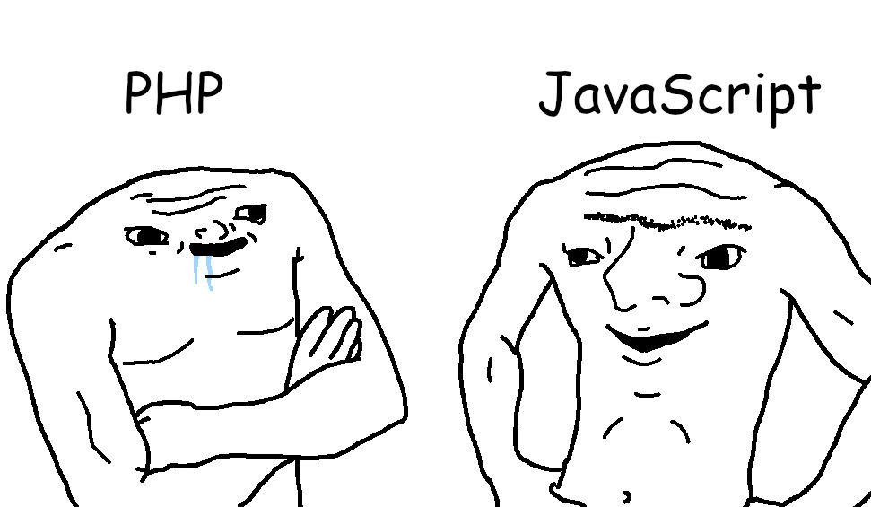
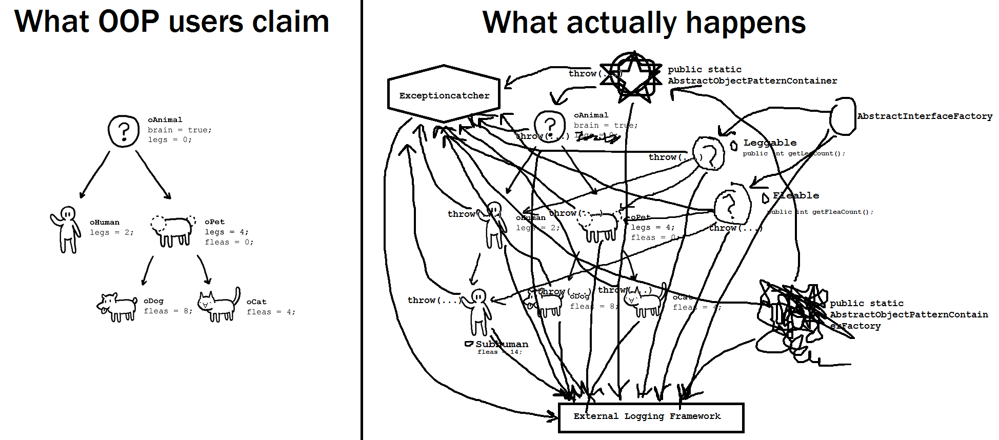

---
title: "Top 10 Design Flaws in Programming Languages"
author: "Arthur Hugonnot"
date: December 3, 2021
...


Introduction
============

### What this conference is about

- Criticism
- Theoretical point of view

### What this conference is not about

- Historical context
- Technical trade-offs

### Disclaimers

- I'm not all-knowing
- Subjectivity

### Disclaimers

*A programming language designer should be responsible for the mistakes made by
programmers using the language.* -- Tony Hoare, inventor of ALGOL W.


Perl's Pronoun
==============

### Perl's Pronoun

What does it do ?

### Perl's Default Variable

- Implicit variable
- Is assumed by Perl in many contexts
- Global
- Topic

### Contexts examples

- Some functions as default argument
- Pattern matching operations without operators
- foreach loops with no iterator

### Issues

- Incorrect use can ruin readability
- Some functions might use it behind your back
- Takes time to replace with an explicit variable
- No clues about the data's nature


`=` for assignments and `==` for equality
=========================================

### Historically

- It was a mess...

### Historically

|         | Assignment | Equality |
| :-----: | :--------: | :------: |
| FORTRAN |          = |     .EQ. |
|  Pascal |         := |        = |
|   BASIC |          = |        = |

### Historically

- C came in 1972
- Popularized the syntax

### Common Mistake

- Use `=` instead of `==`

### PHP and JavaScript...

{height=100%}

### PHP and JavaScript...

- Use `===` for value & type equality aka strict equality
- `==` tests the equivalence

### Alternative

- Use `:=` for assignation
- Use `=` for equality

### Python's Walrus

- A new operator: `:=`
- Assignment as expression


Dynamic Type Checking
=====================

### Three methods

- Static Type Checking Without inference
- Static Type Checking With inference
- Dynamic Type Checking

### Static Type Checking - Without inference

- Type checked at compile time
- Types are specified by user

### Static Type Checking - Without inference

``` C
int main(void)
{
  short a = 2;
  char  b = 3;
  return a + b;
}
```

### Static Type Checking - With inference

- Type checked at compile time as well
- Types are automatically detected: `inferred`

### Static Type Checking - With inference

``` Ocaml
$ let add a b = a +. b;;
val add : float -> float -> float = <fun>
$ let a = 2. in
  let b = a +. 1. in
  let c = add a b in
    print_float c;
    print_newline ();;
5.
- : unit = ()
```

### Dynamic Type Checking

- Type checked at runtime
- Mostly interpreted languages

### Issues

- If erroneous code is not executed, errors remains undetected
- Strange and hard-to-track errors
- Impossible to maintain large scale project

### Uses

- Learning
- Small scripts
- Object Oriented


The Billion Dollar Mistake: Null pointers
=========================================

### Historical Context

- Tony Hoare & Niklaus Wirth
- Early 60's
- ALGOL W
- First type system for pointers in OOP

### Historical Context

- Speed over safety
- Laziness

### Historical Context

*I call it my billion-dollar mistake…At that time, I was designing the first
comprehensive type system for references in an object-oriented language. My
goal was to ensure that all use of references should be absolutely safe, with
checking performed automatically by the compiler. But I couldn’t resist the
temptation to put in a null reference, simply because it was so easy to
implement. This has led to innumerable errors, vulnerabilities, and system
crashes, which have probably caused a billion dollars of pain and damage in the
last forty years.* -- Tony Hoare, inventor of ALGOL W.

### Issues

Cause undefined behaviors and random crashes

### Issues

Highlights other design flaws

``` Java
int x = null; // Compile error

Integer i = null;
int x = i;    // Runtime error
```

### Issues

Ambiguity between undefined/empty and non-existing value

``` Java
if (str == null || str.equals(""))
{
  /* string manipulations */
}
```

### Issues

Creates special cases

``` C
int *x = 42; // Compile Error
int *x = 0;  // Valid
```

### Issues

- null is of any type
- null is everywhere (nil, nullptr, None, Nothing, ...)

### Issues

*"If you have a null reference, then every bachelor who you represent in your
object structure will seem to be married polyamocursly to the same person
Null".* -- Dijkstra

### Alternative

- Optionals, Maybes, Some...
- An entity that *may* contain data of type T

### Uses

- When speed is a priority


JavaScript's *undefined*
========================

### JavaScript's *undefined*

- Difference between non-existing property and null property
- What if the property exists but is set to *undefined* ?

### Prepare for trouble, make it double

{height=100%}


The Trillion Dollar Mistake: Object Oriented Programming
========================================================

### Disclaimers

- Biased
- Problems lies in implementations

### Fuck it

OOP is shit

### Object Oriented Programming

- People worship OOP
- Some languages offers no alternative
- Looks good on small projects but explode in complexity in large projects

### Too many choices

- Inheritance
- Virtual methods
- Polymorphism

### Too many choices

- Good programmers produce bad code, bad programmers produce horrible code
- Limit choices => limit errors

### Too many choices

*"C++ is a horrible [object-oriented] language… And limiting your project to C
means that people don’t screw things up with any idiotic “object model” c&@p."*
-- Linus Torvalds, the creator of Linux

### Scattered

- Scattered state
- Scattered code

### Design Patterns

- Too many of them
- Some of them are really hard to understand
- Band-aids

### Testing

- Hard to unit test
- Recreate object state
- Test with every single possible state of an object

### Spaghetti codebase

{height=100%}

### Weird discussions

``` C++
class Vehicle
{
  virtual void run();
}

class Car : Vehicle
{
  void run();
}
```

### We got OOP wrong

*"I’m sorry that I long ago coined the term “objects” for this topic because it
gets many people to focus on the lesser idea. The big idea is messaging."*
- Alan Kay, the inventor of OOP

### We got OOP wrong

- It's all about messages
- Messages are *immutable*
- No inheritance, no polymorphism

### Alternative ?

Plain procedural works

### Alternative ?

- Classes -> Records/Structs
- Methods -> Functions with an additional argument
- Inheritance -> Embedded records/structs


Conclusion
==========

### Resources

- https://betterprogramming.pub/object-oriented-programming-the-trillion-dollar-disaster-92a4b666c7c7
- https://www.infoq.com/presentations/Null-References-The-Billion-Dollar-Mistake-Tony-Hoare/

### Conclusion

- Much ranting
- I'm biased
- Feel free to criticize

### Questions

Any questions ?
